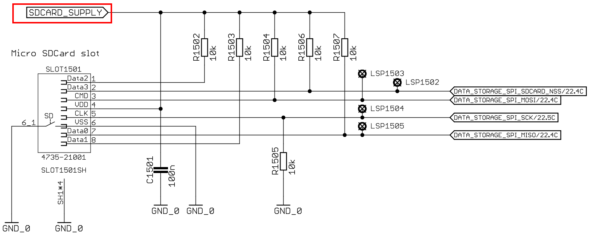
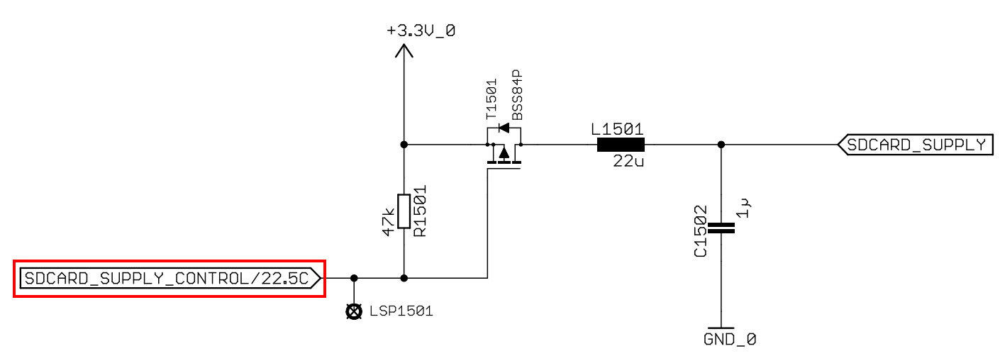

An SD Card female connector is available on foxBMS Extension board. It is therefore, available for us to store and read some data under, such as, text files, csv files. In the range of this post, I firstly programm the SD card as a **module** in src for primary MCU. Then, in the second part, I will create a task to write and read data in text file. Let's begin this task by several preparations!

### Notices
The version of foxBMS's embedded software I am using is NOT the newest version-1.0.0. There might needed changes, but I hope that the following jobs can be integrated easily into the newest software version.

## [Requirements] 
1/ A SD Card, which is formated under FAT. You can do it by Quick Format in Windows. 

2/ [FatFs](http://elm-chan.org/fsw/ff/00index_e.html) Module by Chan. I used FatFs R0.13a. For a easier setup, I recommend to download the "FatFs sample projects for various platforms" (scroll down to the end of the FatFs page and download!). 

3/ A running foxBMS project on Eclipse. Debugging with Eclipse is not important, because I got problems while using Eclipse under Debug mode. So, it must only compile and generate ".hex" file.

## [Getting Start]
The foxBMS communicates with SD card through SPI6 perripheral, which is also shared for EEPROM module. Therefore, each time reading and writing to SD card, users must check whether the EEPROM is deployed or not. Moreover, the SD Card is by default not deployed by the program, i.e, not powered. An output low on SDCARD_SUPPLY_CONTROL will let the card turn on for functions.

{:class="img-responsive"}
*Figure 1: Connections at SD Card module on BMS Extension board.*

*Figure 2: SD card"s power supply control.*
## [Programming]
1/ Naviagate to "../foxBMS_primary/src/module/" . Create a new folder: sdcard.

2/ Remember that we downloaded the "FatFs sample projects for various platforms"? For the task I am doing, I need to copy those files: **ff.h, ff.c, ffconf.h, ffunicode.c, integer.h, diskio.h, mmc_stm32f1.c** in the sample for STM32 folder. For anyone that are familiar to FatFs, the file "mmc_stm32f1.c" has the same function as "diskio.c". Therefore, I prefer to rename **mmc_stm32f1.c** into **diskio.c**. 

3/ Let's go through the **ffconf.h**, I will only mention the changes in comparision to the original sample.

"#define FF_USE_STRFUNC 2": Useful if we wanto read lines in files.

"#define FF_USE_FIND 1"

"#define FF_USE_FASTSEEK 1"

"#define FF_USE_FORWARD 1"

"#define FF_CODE_PAGE 850"

"#define  FF_USE_LFN 2": Enable Long File Name instead of **8.3** format. As the name says, it allows FatFs to read file names, which are longer than 8 characters.

"#define	FF_LFN_UNICODE	0"

"#define FF_VOLUMES 1", "#define FF_STR_VOLUME_ID 1", "#define FF_VOLUME_STRS		"SD": those three configurations come together, meaning that we use only SD card and prefer to use the name "SD:" for the root directory on SD card while reading and writing. 

"#define FF_FS_LOCK	10": Allow us to open upto 10 files simutaneously.

4/ 
## [Running]